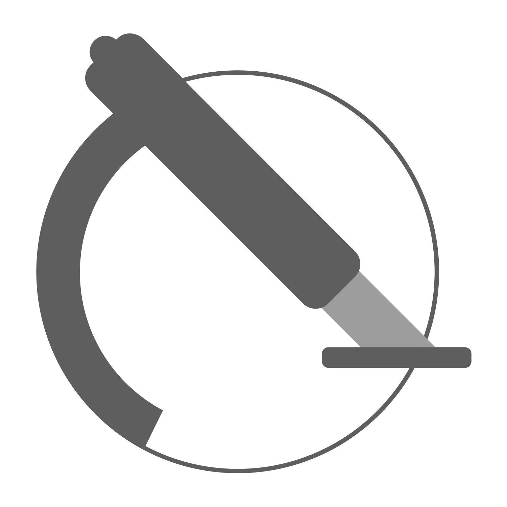
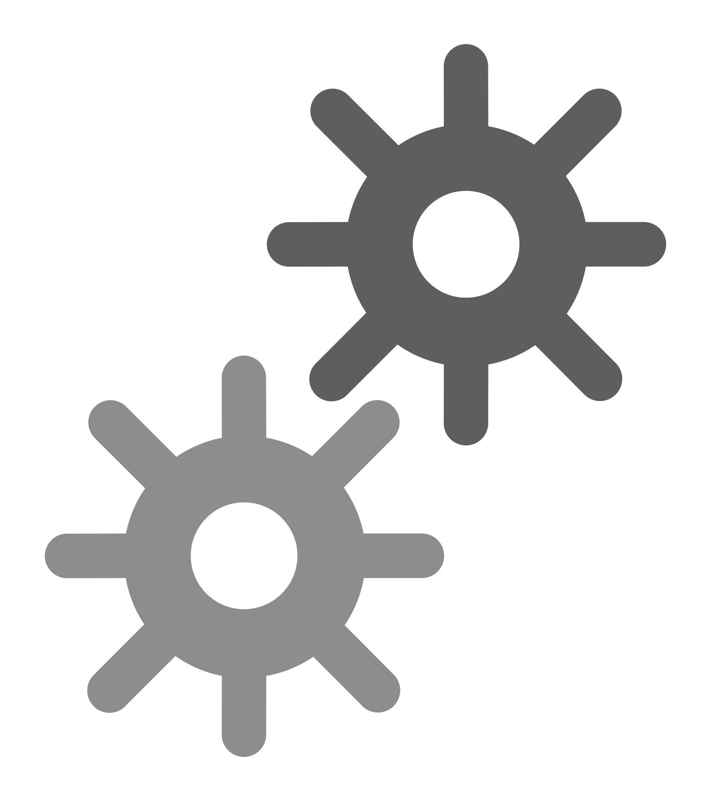
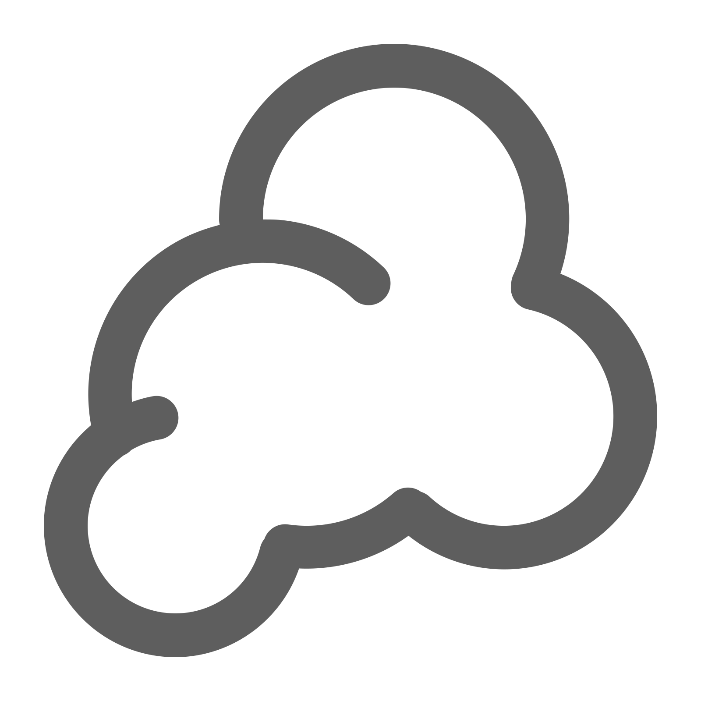
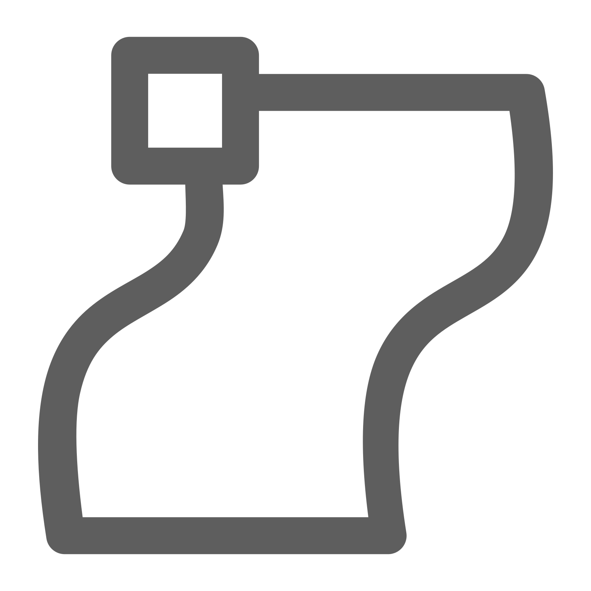
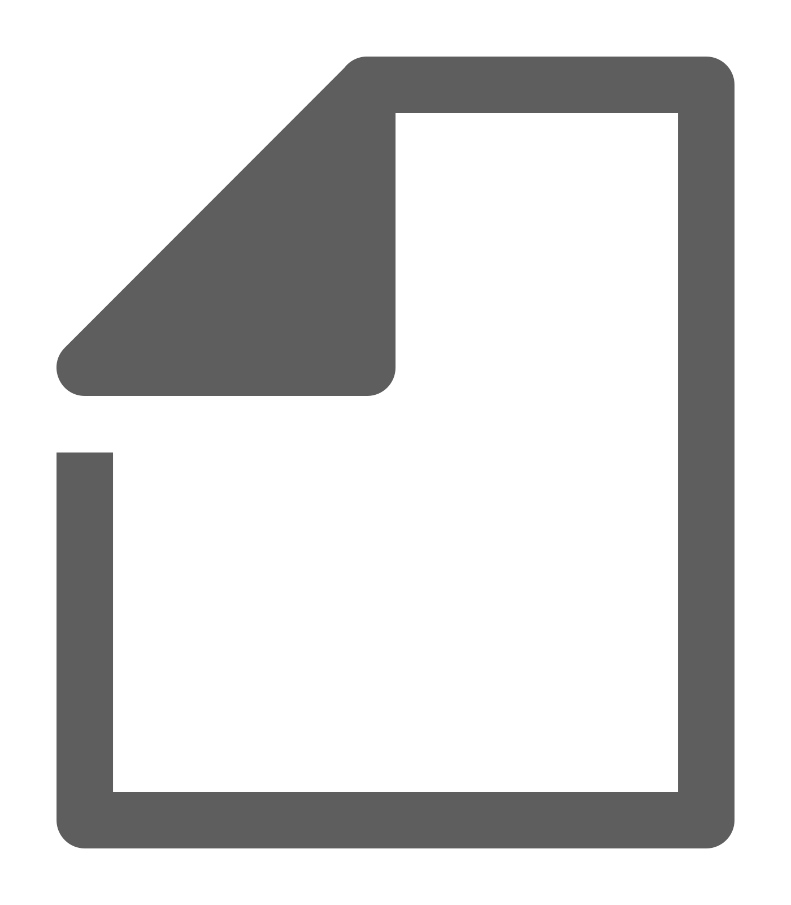
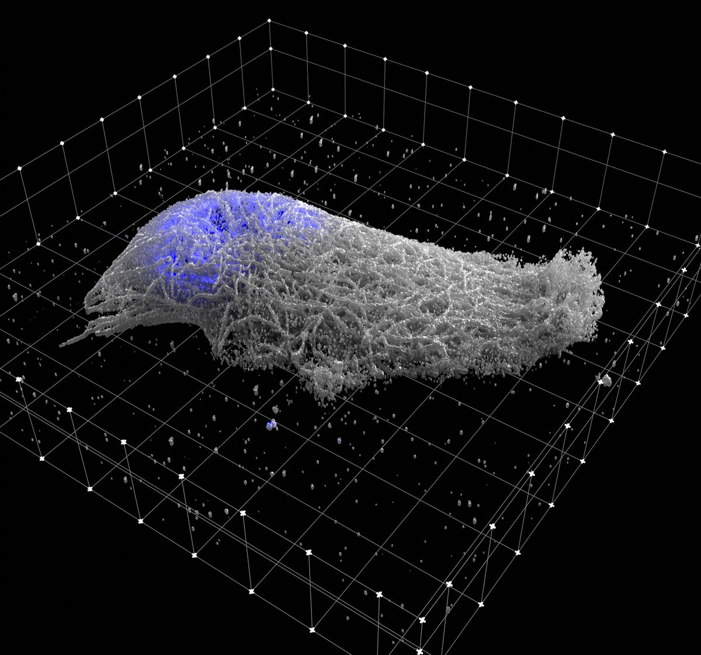

#  Microscopy in Blender

**Microscopy Nodes** is a Blender add-on for visualizing high-dimensional microscopy data—designed for scientists, or anyone working with biological images 😊.

 For any type of microscopy: fluorescence, electron microscopy, or anything in between! This tool helps you turn complex 3D+ datasets into stunning, accurate, and animatable visualizations. 


##   What It Does

Microscopy Nodes supports importing **up to 5D** microscopy datasets (XYZ + time + channels) from `.tif` and **OME-Zarr** files, setting easy and adaptable settings to start with visualizing your data.


| Feature | Description |
|--------|-------------|
| **5D Support** | Load `.tif` and `.zarr` files with any axis order 'tzcyx' or any subset |
| **Channel Interface** | Define how to load each channel:  volume,  surface,  label mask |
| **Colors and LUTs** | Easy picking of colors per channel or non-linear LUT selection from [many colormaps](https://cmap-docs.readthedocs.io/en/stable/).  |
| **Intuitive Slicing** | Slice any object by moving the Slicing Cube, as you would move any other Blender object |
| **Scales** | 3D scale grid for accurate representation and physical Blender scales for easy registration.  |
| **Large Volumes** | Build your animation and visualization on a downscaled version, render with your massive dataset! |


##  Installation

You can grab the add-on on the [Blender Extensions Platform](https://extensions.blender.org/add-ons/microscopynodes/)  
Or, search **Microscopy Nodes** in Blender Preferences → Get Extensions. (Blender 4.2+)

For earlier versions, check the [legacy install guide](https://oanegros.github.io/MicroscopyNodes/outdated).

Once installed, find it under Scene Properties  .

##   Video tutorials

Check out the [video tutorial playlist](https://www.youtube.com/playlist?list=PLAv6_GEMrbKdpje81juHowSCw-gWOJwy5) on YouTube for quick guides on:
- Installation
- Loading data
- Fluorescence & EM visualization
- Making presentation-ready renders

*youtube videos are now slightly updated but will be updated within May 2025*

<p align="center"></p>


## First use

1. Load your file (local path or URL) into the **Microscopy Nodes** panel in Scene Properties  
2. The metadata will auto-load, and you can define how each channel is visualized
3. Adjust per-channel options like:
   - Volume or isosurface rendering
   - Label masks
   - Emission, resolution, and colors
4. Customize dataset settings like:
   - Axis order
   - Physical pixel size
   - Reload behavior & storage location

More detail in the [full docs](https://oanegros.github.io/MicroscopyNodes/).

## Show Off Your Vizualizations!

If you create something cool using `Microscopy Nodes`, share it!  
Tag me [@GrosOane on Bluesky](https://bsky.app/profile/grosoane.bsky.social) or use the hashtag `#microscopynodes`.

If you publish with this add-on, please cite [the preprint](https://www.biorxiv.org/content/10.1101/2025.01.09.632153v1):
```
@article {Gros2025.01.09.632153,
	author = {Gros, Oane and Bhickta, Chandni and Lokaj, Granita and Schwab, Yannick and K{\"o}hler, Simone and Banterle, Niccol{\`o}},
	title = {Microscopy Nodes: versatile 3D microscopy visualization with Blender},
	elocation-id = {2025.01.09.632153},
	year = {2025},
	doi = {10.1101/2025.01.09.632153},
	publisher = {Cold Spring Harbor Laboratory},
	URL = {https://www.biorxiv.org/content/early/2025/01/14/2025.01.09.632153},
	eprint = {https://www.biorxiv.org/content/early/2025/01/14/2025.01.09.632153.full.pdf},
	journal = {bioRxiv}
} 
```

