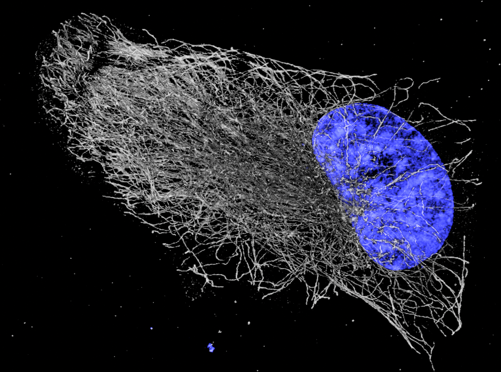

# tif to blender 
This is a project building bioimage support for the open source software blender. This currently exists as the Blender add-on `tif loader` which is able to easily load tif files as volumetric objects in Blender. 

This originally started as a script for the [Blender for Biologists workshop](https://github.com/oanegros/Blender_for_Biologists_2023), so this is currently still the location of documentation for installing and using the add-on. Because the scope seems to have outgrown this workshop, the development has split off.

Please make some pretty figures with this add-on!

